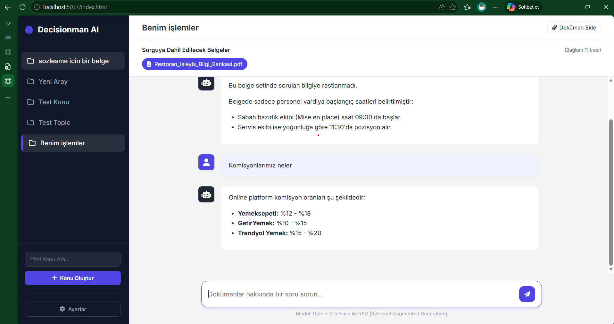

# 🧠 Decisionman RAG System

**Decisionman**, ASP.NET Core web API üzerine kurulu, PostgreSQL (pgvector) ve Google Gemini API kullanarak geliştirilmiş, doküman bazlı bir Retrieval-Augmented Generation (RAG) platformudur. Süreçleri deneyimlemek için yapılmıştır.



## 🚀 Öne Çıkan Özellikler

- **Çoklu Doküman Desteği:** PDF ve Excel (`.xlsx`, `.xls`) dosyalarını vektörel verilere dönüştürerek analiz eder.
- **Konu (Topic) Bazlı Yönetim:** Dokümanları ve sohbetleri konulara ayırarak organize edin.
- **Akıllı Filtreleme:** Soru sorarken hangi dokümanların bağlam (context) olarak kullanılacağını tek tıkla seçin.
- **Kalıcı Sohbet Geçmişi:** Tüm kullanıcı mesajları, AI yanıtları ve dosya yükleme olayları veritabanında saklanır.
- **Dinamik Ayarlar:** API anahtarlarını kod veya config dosyası yerine doğrudan arayüz üzerinden yönetin.
- **Modern UI:** Glassmorphism etkili, Inter fontu ile optimize edilmiş, şık kullanıcı arayüzü.

## 🛠️ Teknoloji Yığını

- **Backend:** .NET 8 ASP.NET Core Web API
- **Database:** PostgreSQL with `pgvector` extension
- **AI Engine:** Google Gemini API (Pro & Flash support)
- **Frontend:** Vanilla JS, CSS3, Google Fonts (Inter)
- **Parsing:** PdfPig (PDF), ExcelDataReader (Excel)
- **Storage:** Local Storage (MinIO desteği hazır)

## 📦 Kurulum

1.  **Veritabanı:**
    - PostgreSQL üzerinde `pgvector` eklentisinin kurulu olduğundan emin olun.
    - `appsettings.json` içerisindeki `DefaultConnection` dizgisini güncelleyin.
    - `dotnet ef database update` komutu ile tabloları oluşturun.

2.  **Bağımlılıklar:**
    ```bash
    dotnet restore
    ```

3.  **Çalıştırma:**
    ```bash
    dotnet run
    ```

4.  **Ayarlar:**
    - Uygulama açıldığında sol alttaki **Ayarlar** butonuna tıklayın.
    - **Google Gemini API Key**'inizi girin ve kaydedin.

## 📁 Dosya Yapısı

- `Controllers/`: RAG, Settings ve Topic API uç noktaları.
- `Services/AI/`: Gemini entegrasyonu ve embedding işlemleri.
- `Services/RAG/`: Vektör arama ve bağlam oluşturma mantığı.
- `Services/Documents/`: PDF ve Excel parçalama (chunking) mantığı.
- `wwwroot/`: Modern HTML/JS arayüzü.

## 📝 Notlar

- Dokümanlar yüklenirken 4000 karakterlik parçalara (chunks) ayrılır ve her parça için vektör embedding oluşturulur.
- Sohbet listesi, en son mesaj atılan konuya göre otomatik olarak sıralanır.
